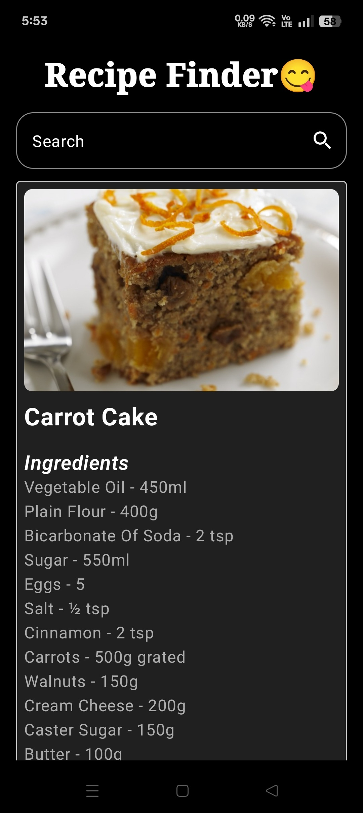

# Recipe Finder App

A modern Android recipe search app built with Jetpack Compose and MVI architecture. Easily search and explore meals using TheMealDB API.

## 📸 Screenshots

  

## ✨ Features

- 🔎 Instant recipe search
- 🍳 Ingredient & instructions view
- 🎨 Modern dark UI with animations
- ⚙️ Built with Kotlin + Jetpack Compose

## 🔧 Tech Stack

- **Language**: Kotlin
- **UI**: Jetpack Compose
- **Architecture**: MVI (Model-View-Intent)
- **Networking**: Retrofit
- **Image Loading**: Coil
- **State Management**: ViewModel + StateFlow

## 🔌 API
- [TheMealDB API](https://themealdb.com/)

## 🙌 Contributing

Contributions are welcome!  
If you find any issues or want to enhance the app, feel free to submit a pull request.
 

### Made with ❤️ by Monotosh